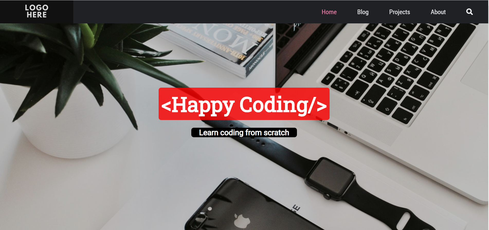
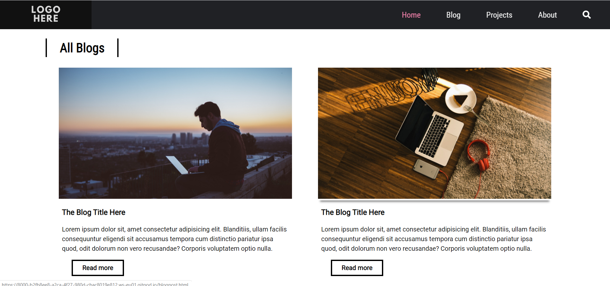
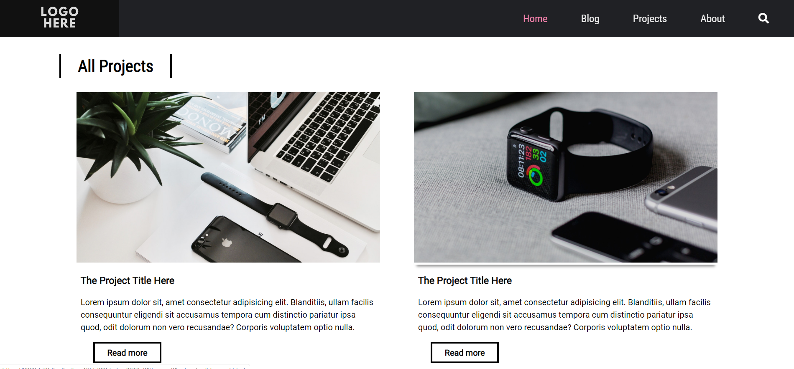
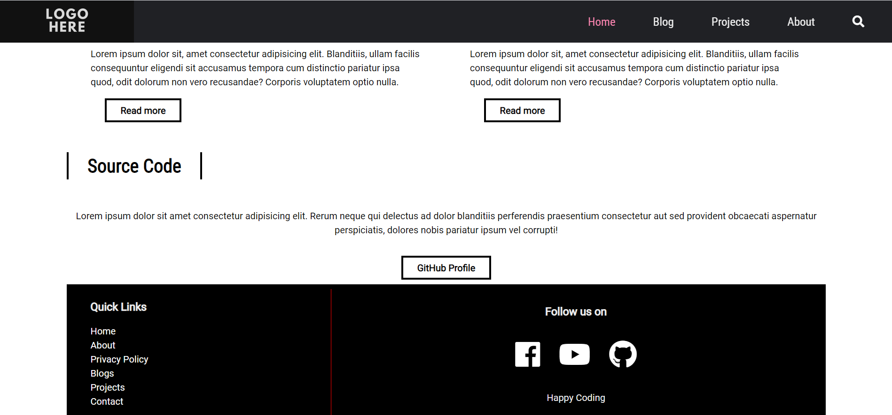

# Responsive-Website-using-HTML-CSS-JS-PHP

## To view the live site, [CLICK HERE](https://abdoelsaih.github.io/Responsive-Website-using-HTML-CSS-JS-PHP/index.html)

## Technologies Used
- HTML
- CSS
- JS
- PHP
## Mobile-responsive
- The webpages work on small to medium devices (i.e. mobile phones to laptops).

## Testing
- [W3C](http://validator.w3.org/#validate_by_uri) - Validate by direct input
- Site tested on these browsers: Google Chrome - Internet Explorer - Mozilla Firefox - Microsoft Edge - Safari

## Deployment
- The website was published using [GitHub pages]https://abdoelsaih.github.io/Responsive-Website-using-HTML-CSS-JS-PHP/index.html)

